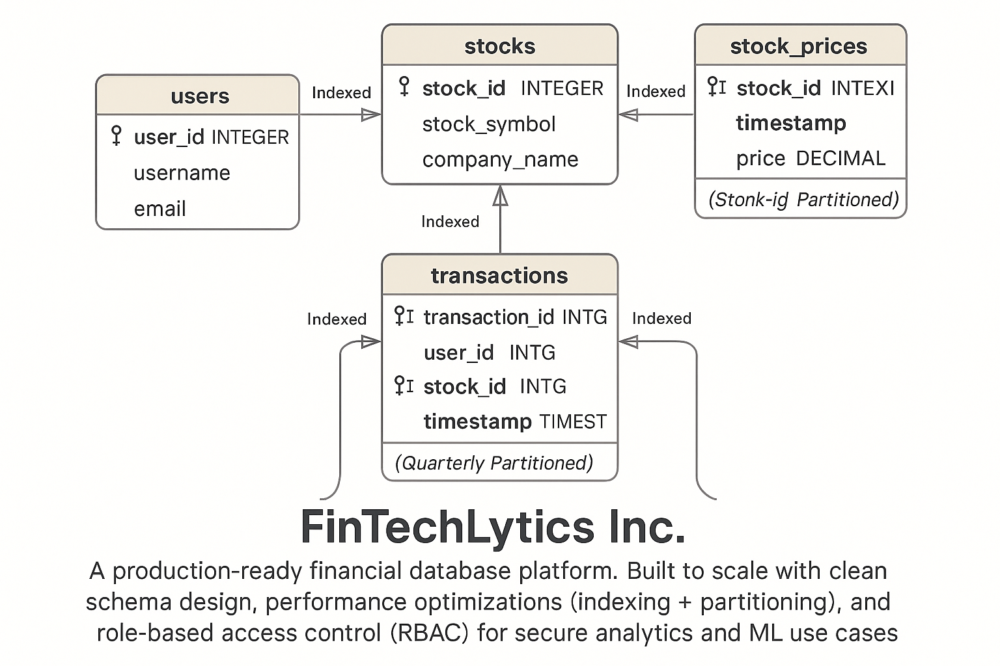

# Fintechlytics-database-capstone


-- Schema Design
## Design Rationale
Composite index on (stock_id, timestamp) accelerates time-series lookups and windowed analytics.
Monthly/Quarterly partitioning balances query speed and maintenance for large historical datasets.
RBAC enforces least privilege, reducing blast radius and aligning with team workflows (Admin, Data Eng, Analysts, ML).
## Core tables
- `users` — user profiles and metadata  
- `stocks` — tradable stock metadata  
- `stock_prices` — time-series price history  
- `transactions` — user buy/sell activity  
- `portfolios` — current user holdings (position and average price)
## Key constraints and integrity
- Primary keys on all base tables  
- Foreign keys with `ON DELETE CASCADE` to maintain referential integrity  
- `CHECK` constraints (e.g., transaction type, positive quantity)  
- Uniqueness constraints (e.g., `users.email`, `stocks.symbol`, `(user_id, stock_id)` in portfolios)
## Optimization Rationale:
 To enhance performance and scalability, key optimization techniques were applied: 
## (1)Indexing Strategy: 
Indexing was implemented on all foreign key columns (user_id, stock_id) in the Transactions,Stock_Prices, and Portfolios tables to improve the efficiency of JOIN operations and WHERE clause 
filters.
```sql
-- Transaction table
CREATE INDEX idx_transactions_user_id ON transactions(user_id);
CREATE INDEX idx_transactions_stock_id ON transactions(stock_id);

-- StockPrices table foreign key
CREATE INDEX idx_stock_prices_stock_id ON stock_prices(stock_id);

-- Portfolios table foreign keys
CREATE INDEX idx_portfolios_user_id ON portfolios(user_id);
CREATE INDEX idx_portfolios_stock_id ON portfolios(stock_id);  

(ii) A composite index was created on (stock_id, timestamp) in the Stock_Prices table to optimize time-series queries, which are common in stock analysis.
-- Time-series composite
  CREATE INDEX idx_stock_prices_stock_time ON stock_prices(stock_id, timestamp);
  ``` 
  ## Partitioning:
stock_prices partitioned monthly by timestamp (scales time-series queries and ingestion)

transactions partitioned quarterly by timestamp (fits audit/report cycles)
```sql
-- Parent (example)
CREATE TABLE stock_prices (
    price_id   BIGSERIAL PRIMARY KEY,
    stock_id   INTEGER NOT NULL,
    price      NUMERIC(10,2) NOT NULL,
    timestamp  TIMESTAMP NOT NULL
) PARTITION BY RANGE (timestamp);
-- One monthly child (repeat per month)
CREATE TABLE stock_prices_2025_01 PARTITION OF stock_prices
FOR VALUES FROM ('2025-01-01') TO ('2025-02-01');
```
## Role-Based Access Control 
-- Roles and permissions
admin — full control on schema objects; can manage roles/DB if granted at role level.
data_engineer — SELECT/INSERT/UPDATE/DELETE on tables, CREATE on schema, USAGE on sequences.
data_analyst — read-only SELECT on warehouse tables.
ml_engineer — SELECT on core analytical tables; CREATE and INSERT/UPDATE on ML outputs (e.g., predicted_prices).
```sql
-- Analysts (read-only)
GRANT SELECT ON ALL TABLES IN SCHEMA public TO data_analyst;
-- Data Engineers (ETL build/maintain)
GRANT SELECT, INSERT, UPDATE, DELETE ON ALL TABLES IN SCHEMA public TO data_engineer;
GRANT USAGE ON ALL SEQUENCES IN SCHEMA public TO data_engineer;
GRANT CREATE ON SCHEMA public TO data_engineer;
-- Admin (full object privileges)
GRANT ALL PRIVILEGES ON ALL TABLES    IN SCHEMA public TO admin;
GRANT ALL PRIVILEGES ON ALL SEQUENCES IN SCHEMA public TO admin;
GRANT ALL PRIVILEGES ON ALL FUNCTIONS IN SCHEMA public TO admin;
-- Create ML outputs table
CREATE TABLE IF NOT EXISTS predicted_prices (
  id          BIGSERIAL PRIMARY KEY,
  stock_id    INTEGER NOT NULL REFERENCES stocks(stock_id) ON DELETE CASCADE,
  predicted_at TIMESTAMP NOT NULL,
  predicted_price NUMERIC(10,2) NOT NULL
);
GRANT INSERT, UPDATE ON predicted_prices TO ml_engineer;
```
## conclusion
These optimization and access control strategies were implemented to support a high-performance, 
secure, and scalable FinTechLytics analytics platform. The structure ensures that each role has the exact 
access required to perform their tasks efficiently without compromising data integrity or security.